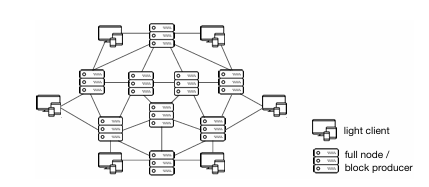
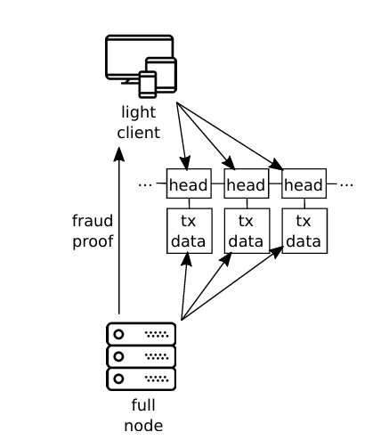

# Kasavinal Light Client.

Light client for Kasavinal DA

Nodes in Kasavinal DA are differentied as Light and full nodes.

Full nodes participate in consensus, produce blocks, store data. While Light nodes receive LightBlockHeaders from full nodes and sample shares from the full nodes to confirm the availability of data.

If any non consensus full node participating network, detects that data received from consensus full nodes to light clients is byzantine, it creates and sends fraud proofs to all light clients connected to that full node in the network.
