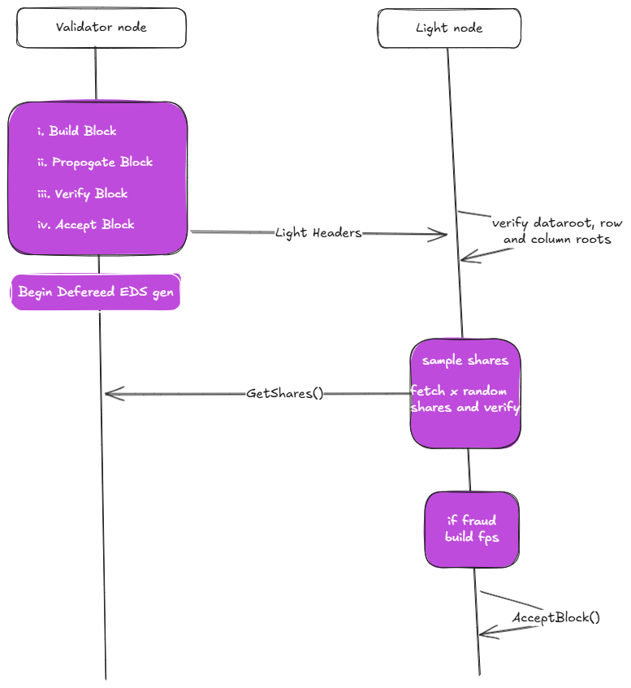

# Kasavinal Light Client.

Light client for Kasavinal DA

DA E2E flow


Nodes in Kasavinal DA are differentied as Light and full nodes.


Full nodes participate in consensus, produce blocks, store data. While Light nodes receive LightBlockHeaders from full nodes and sample shares from the full nodes to confirm the availability of data.

If any non consensus full node participating network, detects that data received from consensus full nodes to light clients is byzantine, it creates and sends fraud proofs to all light clients connected to that full node in the network.


## How to run and testing:

```go
    git clone git@github.com:manojkgorle/hypersdk.git
    git clone git@github.com:manojkgorle/kasavinal.git
    cd hypersdk
    git checkout da
    cd examples/morpheusvm
    ./scripts/build.sh
    ./scripts/run.sh

    // In new shell with morepheusvm as roo
    ./build/morpheus-cli chain import-anr
    ./build/morpheus-cli key import ed25519 demo.pk
    ./build/morpheus-cli spam run
    // choose spam options

    // In new shell with kasavinal as root.
    // copy the rpc uri and chain id str after running the command import-anr in last shell
    // replace the chain id and uri fields in main.go
    go run main.go

```